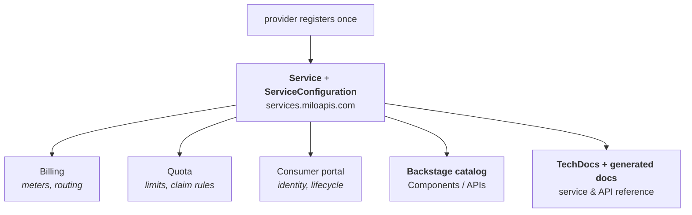

# Enhancement: Backstage & docs as downstream consumers of the Service Catalog

**Status:** Draft for stakeholder review
**Author:** Service infrastructure team
**Scope:** Makes Datum's Backstage developer portal (catalog + TechDocs) read from the [`Service`](./service-registry.md) / `ServiceConfiguration` registry instead of discovering services a parallel way. Introduces one additive `Service` spec field and one new controller. No change to the existing registry contract.

> **In one line.** Providers already register a service once; make Backstage catalog entries, published docs, and generated reference pages three more things that registration drives — not a second discovery mechanism to keep in sync.

---

## The problem

The Service Catalog is already the platform's authoritative service registry. A provider registers a `Service` (identity) and a `ServiceConfiguration` (what it contributes — monitored resource types, metrics, billing routing, quota, locations), and billing, quota, telemetry, and the consumer portal all *read* from it. Providers write once; the platform propagates everywhere. That is the whole point of the registry: one owned record, many downstream consumers, no re-declaration.

Datum's Backstage developer portal does not follow this pattern. It discovers services the Backstage-native way: a `catalog-info.yaml` file committed into each service's repository, scanned from GitHub by a discovery provider. That is a **second registry**, parallel to the one every provider already has to populate.

Two registries for the same fact drift in exactly the ways the Service Catalog was built to prevent:

- A service is registered in the catalog as `compute.miloapis.com` but its `catalog-info.yaml` says `Compute API` with a different owner — and nothing reconciles them.
- A service is deprecated in the registry (`spec.phase: Deprecated`), but its Backstage `Component` still reads `lifecycle: production` because no one edited the YAML in the repo.
- A new provider registers a service and it shows up in billing, quota, and the portal automatically — but is invisible in Backstage until someone remembers to hand-author a `catalog-info.yaml` and wire up GitHub discovery.
- Docs live in a third place again (a wiki, a repo), keyed to neither the registry nor the Backstage entity, so the portal can link to a service it can't describe.

This is the same class of problem [`service-registry.md`](./service-registry.md) opens with — identity as a free-text string that drifts — reappearing one layer up, in the developer portal.

## The model: Backstage as a consumer, not a discoverer

The fix is to treat Backstage the way billing, quota, and the portal are already treated: **a downstream consumer that reads the registry**, not a system that re-discovers services on its own.

Concretely, one provider registration drives three things, all keyed off the same `Service` / `ServiceConfiguration` records:

1. **Backstage catalog registration** — a Backstage `EntityProvider` reads the Service Catalog API and projects the CRs into Backstage catalog entities. No `catalog-info.yaml` required for a service to appear.
2. **Docs publishing** — a controller reconciles *Published* services and publishes their documentation into Backstage TechDocs, keyed to the entity coordinate derived from `serviceName`.
3. **Document generation** — because the CRs are structured, the platform doesn't just *move* docs, it *generates* them: a service-reference page from `Service` + `ServiceConfiguration`, and an API/resource reference from the monitored resource types and metric definitions.

The registry is the spine. A repo may still ship a `catalog-info.yaml` to *supplement* an entity with repo-local facts (source location, CI status, per-repo TechDocs), but it is no longer the mechanism by which a service exists in the portal. The registry is.



---

## Driver 1 — Backstage catalog registration

A Backstage `EntityProvider` lists `Service` and `ServiceConfiguration` resources from the Service Catalog API and mutates the Backstage catalog to match. The Backstage entities become **generated artifacts** of the registry, the same way `MeterDefinition` and `ResourceRegistration` CRDs are generated artifacts of `ServiceConfiguration`.

### Field-level projection mapping

The mapping below is grounded in the real `api/v1alpha1` types, not the Backstage-side wish list. Where the source field differs from a first guess, the "notes" column calls it out.

#### `Service` → `Component` (+ `System`, `Domain`)

| Backstage target | Source field | Notes |
| --- | --- | --- |
| `kind: Component` | — | One `Component` per `Service`. `spec.type: service`. |
| `metadata.name` | `metadata.name` (the slug, e.g. `compute-miloapis-com`) | **Not** `serviceName`. `metadata.name` is already DNS-safe and stable; `serviceName` carries dots and is stored as title + annotation. See [entity-coordinate rule](#entity-coordinate-mapping). |
| `metadata.title` | `spec.displayName` | Required on the CR; always present. |
| `metadata.description` | `spec.description` | Optional on the CR (`omitempty`). |
| `metadata.annotations[miloapis.com/service-name]` | `spec.serviceName` | The canonical reverse-DNS join key, preserved verbatim for cross-system lookup. |
| `spec.owner` | `spec.owner.producerProjectRef.name` → `group:default/<name>` | **Correction:** owner is a typed *producer-project* reference, not a team/user string. It must resolve to a Backstage `Group`. Depends on org/User sync — see [risks](#open-questions--risks) and infra#2967. |
| `spec.lifecycle` | `spec.phase` | `Draft`→`experimental`, `Published`→`production`, `Deprecated`→`deprecated`, `Retired`→`archived` (lifecycle is free-form; these are conventions). |
| `spec.dependsOn` | `spec.dependencies[].serviceRef.name` | **Correction:** dependencies reference the dependency's `metadata.name` (slug), *not* its `serviceName`. The provider has every `Service` in hand, so it resolves each slug to that service's `component:default/<slug>` coordinate. |
| `metadata.annotations[miloapis.com/enablement-mode]` | `spec.enablementPolicy.mode` | `SelfService` / `GatedByProvider`. Optional; useful signal for portal tooling. |
| `metadata.annotations[miloapis.com/published-at]` | `status.publishedAt` | From `CatalogStatus`. |
| `System` (derived) | `spec.owner.producerProjectRef.name` | All services owned by one producer project group into a `System`. |
| `Domain` (derived) | reverse-DNS suffix of `spec.serviceName` | e.g. every `*.acme.com` service rolls up to an `acme.com` `Domain`. A modeling choice — see [risks](#open-questions--risks). |

#### `ServiceConfiguration` → `API` entities + Component annotations

`ServiceConfiguration` is the richer document. It has no OpenAPI/proto surface — so the "API reference" here is really a **resource-type + metrics reference**: the Kubernetes Kinds a service exposes for billing/monitoring, plus the metrics they emit and the quota that governs them. That reframing is the main correction to the original design sketch.

| Backstage target | Source field | Notes |
| --- | --- | --- |
| `kind: API`, one per resource type | `spec.monitoredResourceTypes[]` | Each entry is a billable/monitored Kubernetes Kind. `metadata.title`←`.displayName`, `metadata.description`←`.description`, `spec.type: kubernetes-resource-type`. |
| API `metadata.name` | `spec.monitoredResourceTypes[].type` (e.g. `compute.miloapis.com/Instance`) | Normalized to a Backstage-safe token (`/`→`-`). |
| API annotations (GVK) | `spec.monitoredResourceTypes[].gvk.{group,kind}` | Version is intentionally absent from the CR (billability is a property of the Kind). |
| API `spec.definition` | generated | The generated resource/API-reference page (see [Driver 3](#driver-3--document-generation)). Backstage `API` requires a `definition`; we synthesize it. |
| Component `providesApis` | `spec.monitoredResourceTypes[].type` | Wires the `Component` to the `API` entities it exposes. |
| Component annotations (metrics) | `spec.metrics[]` (`name`, `displayName`, `kind` ∈ Delta/Gauge/Cumulative, `unit` UCUM, `dimensions[]`) | Surfaced as a metrics summary; full detail lands in the generated reference. |
| Component annotations (billing) | `spec.billing.consumerDestinations[]` | Routes metrics → monitored resource type; renders "what is billed on what." |
| Component annotations (quota) | `spec.quota.limits[]` (`name`, `displayName`, `metric`, `consumerType`, `unit`, `defaultLimit`, `maxLimit`) and `spec.quota.metricRules[]` | Default/max limits and the Kinds that consume quota. |
| Component annotations (locations) | `spec.locations.supportedClasses[]` | `datum-managed` / `provider-dedicated` / `self-managed`. |
| link to Service | `spec.serviceRef.name` / `status.serviceName` | `ServiceConfiguration` joins to its `Service` by `metadata.name`; `status.serviceName` carries the resolved canonical name. |

**Phase / visibility.** `Draft` `Service`s and `Draft` `ServiceConfiguration`s are not fanned out to billing today (admission rejects references to Draft resources). The EntityProvider mirrors that rule: it projects `Published`, `Deprecated`, and `Retired` services by default, and treats `Draft` as opt-in (internal visibility only) so the portal does not advertise things the rest of the platform considers unreal. Whether the developer portal *should* surface Draft services to internal teams is an [open question](#open-questions--risks).

---

## Driver 2 — Docs publishing (the docs/generation controller)

Backstage's docs-as-code (TechDocs) model builds an MkDocs site from Markdown and serves it in the portal. Prior investigation established that Backstage's basic/local TechDocs generator cannot run inside our GKE portal pod; the supported production model is **external generation + object storage**: something else builds the docs site and writes it to a bucket, and Backstage reads the built site from that bucket. This proposal is the Kubernetes-native form of that model.

### A `Service` spec addition for the docs reference

The registry has no documentation pointer today. `ServiceSpec` is identity only — `serviceName`, `phase`, `displayName`, `description`, `owner`, `dependencies`, `enablementPolicy`. To let a provider point at authored docs, add one additive, optional field:

```go
// Documentation points at provider-authored documentation for this
// service. The docs controller renders it into TechDocs when the
// service is Published. Optional; when unset the platform still
// generates a reference page from the Service and ServiceConfiguration.
//
// +kubebuilder:validation:Optional
Documentation *ServiceDocumentation `json:"documentation,omitempty"`

type ServiceDocumentation struct {
    // SourceRef locates a docs-as-code source (a Git repo + path
    // containing mkdocs.yml / docs/). Mutually exclusive with URL.
    //
    // +kubebuilder:validation:Optional
    SourceRef *DocumentationSourceRef `json:"sourceRef,omitempty"`

    // URL points at an already-published documentation site to link
    // from the portal without ingesting it into TechDocs.
    //
    // +kubebuilder:validation:Optional
    URL string `json:"url,omitempty"`
}
```

The exact shape (structured field vs. a `docs.miloapis.com/source` annotation) is an [open question](#open-questions--risks); a typed field is the recommendation, consistent with the registry's preference for typed references over free-text annotations.

### Controller design

A new reconciler in this operator — a peer to the billing/quota fan-out reconcilers, not a new service — watches `Service` and `ServiceConfiguration`:

1. **Trigger.** Reconcile on any `Service` (or its `ServiceConfiguration`) in phase `Published` (and re-render on `Deprecated` to stamp a deprecation banner). `Draft` is skipped, matching the billing fan-out.
2. **Generate.** Produce the [service-reference and API-reference pages](#driver-3--document-generation) from the CR fields. If `spec.documentation.sourceRef` is set, fetch the authored docs and merge them with the generated reference into one MkDocs site.
3. **Build.** Run the TechDocs/MkDocs build out-of-pod (a Job or the controller's own builder) — never in the Backstage pod.
4. **Publish.** Write the built site to the TechDocs object-storage bucket under the key derived from the entity coordinate (see below). Backstage's TechDocs reader serves it unchanged.
5. **Status.** Record a `DocsPublished` condition on the `Service` with the storage key and last-built generation, so the portal (and operators) can see whether docs are current.

This is centralized and reconcile-driven: no per-repo CI, no GitHub Actions publishing docs. One controller owns "Published services have current docs in the bucket," and it re-runs whenever the registry changes — the same guarantee billing gets for meters.

### Entity-coordinate mapping

One rule ties the catalog entity, the TechDocs storage key, and the registry record together:

- **Backstage name** = `Service.metadata.name` (the DNS-safe slug), namespace `default`, kind `Component`.
- **Coordinate** = `default/component/<slug>` — this is both the catalog entity ref *and* the TechDocs storage prefix.
- **Canonical name** = `Service.spec.serviceName`, preserved as `metadata.title` + the `miloapis.com/service-name` annotation so anything keyed on the reverse-DNS name (billing, portal, invoices) can still join.

Deriving the coordinate from `metadata.name` (rather than `serviceName`) keeps it DNS-safe without normalization and stable across cosmetic `serviceName` display changes. `serviceName` remains the human-facing canonical identity. This is a deliberate call — the [alternative](#open-questions--risks) (derive the coordinate from `serviceName` for exact parity with billing/quota/portal) is viable and worth confirming.

---

## Driver 3 — Document generation

Because the registry is structured data, the platform can generate documentation, not merely relocate it. Two artifacts come out of the same CRs:

**Service reference page** — from `Service` + `ServiceConfiguration`:

- Identity: `serviceName`, `displayName`, `description`.
- Ownership: the producer project behind it.
- Lifecycle: current `phase`, `publishedAt`, deprecation banner when `Deprecated`.
- Dependencies: the services it pulls in, linked to their own entities.
- Locations: supported location classes.
- What it exposes: a summary table of monitored resource types, metrics, and quota limits.

**API / resource reference** — from `ServiceConfiguration.spec.monitoredResourceTypes`, `spec.metrics`, `spec.billing`, and `spec.quota`:

- Each monitored resource type (GVK Kind) with its permitted usage labels.
- Each metric: name, kind (Delta/Gauge/Cumulative), UCUM unit, dimensions, and which resource type it bills against.
- Quota: default and max limits per metric, and the Kinds whose creation draws them down.

These are the same fields billing and quota already consume to generate `MeterDefinition` and `ResourceRegistration`. Generating docs from them is one more fan-out target, not a new data source. The generated pages become the `API` entities' `spec.definition` and the body of the service's TechDocs site.

---

## Pull vs. push

**Recommendation: Backstage pulls; the docs controller pushes to storage.**

- **Catalog entities — pull.** The Backstage `EntityProvider` lists/watches the Service Catalog API and reconciles the catalog. This matches how billing, quota, and the portal already consume the registry (they read it; the registry does not push to them), keeps Backstage the owner of its own catalog, and means a registry change shows up in the portal on the next poll with no coordination. A push model (a controller writing `catalog-info.yaml` into repos or calling Backstage's API) would re-introduce the very drift and per-repo wiring this proposal removes.
- **Generated docs — push.** The docs controller writes built TechDocs sites to object storage; Backstage's TechDocs reader pulls the built site from the bucket at serve time. This is the required external-generation model and keeps heavy MkDocs builds out of the portal pod.

The split is clean: identity/metadata flows by pull, built doc artifacts flow by push-to-storage-then-pull.

---

## Access & auth

The `Service` and `ServiceConfiguration` CRDs are cluster-scoped on the Milo control plane (`discovery.miloapis.com/parent-contexts=Platform`). Backstage's EntityProvider needs a **read-only credential** on that API:

- A dedicated `ServiceAccount` bound to a read-only `ClusterRole` (`get`/`list`/`watch` on `services.miloapis.com` `services` and `serviceconfigurations`).
- The credential is supplied to the Backstage plugin the same way its other integrations are configured (a mounted kubeconfig / token via External Secrets, following the infra secret conventions).
- The docs controller runs with the operator's existing in-cluster permissions plus write access to the TechDocs bucket.

No write access to the registry is granted to Backstage — it is strictly a reader, like every other downstream consumer.

---

## What exists vs. what to build

**Exists today**

- `Service` and `ServiceConfiguration` CRDs, their controllers, and admission webhooks.
- Billing, quota, and portal reading the registry.
- Backstage deployed in the infra staging environment, discovering services via `catalog-info.yaml` + GitHub org discovery.

**To build**

1. A `Service.spec.documentation` field (additive, optional) + webhook validation.
2. A Backstage `EntityProvider` plugin that pulls `Service`/`ServiceConfiguration` and projects the entities in the table above.
3. A docs/generation reconciler in this operator: generate the reference pages, build TechDocs out-of-pod, publish to object storage, stamp a `DocsPublished` condition.
4. Read-only `ClusterRole` + `ServiceAccount` + credential wiring for the EntityProvider.
5. `Group` entities for producer projects (or reuse the org/User sync from infra#2967 so `owner` refs resolve).

---

## Phased rollout

- **Phase 0 — spec field.** Add `Service.spec.documentation`. Purely additive; no behavior change.
- **Phase 1 — identity projection.** EntityProvider projects `Service` → `Component` (name, title, description, owner, lifecycle, `dependsOn`). Runs alongside `catalog-info.yaml` discovery; registry-sourced entities win on conflict.
- **Phase 2 — configuration projection.** Project `ServiceConfiguration` → `API` entities + metric/billing/quota annotations; wire `providesApis`, `System`, `Domain`.
- **Phase 3 — docs.** Ship the docs/generation controller: generate service- and API-reference pages, publish TechDocs to object storage, link from the entities.
- **Phase 4 — retire parallel discovery.** Make the registry the source of truth for service existence; keep `catalog-info.yaml` only as an optional supplement for repo-local facts.

Each phase is independently shippable and reversible; Phase 1 alone already kills the worst of the drift.

---

## What this isn't

- **Not a replacement for `catalog-info.yaml` everywhere.** Repos keep it for repo-local facts (source location, CI, per-repo docs). The registry owns service *identity*, not everything Backstage can model.
- **Not a new service.** The EntityProvider is a Backstage plugin; the docs work is a reconciler inside the existing operator. No new control plane.
- **Not a docs authoring tool.** Providers still write prose where they want; the platform generates the reference scaffolding and publishes the result.
- **Not runtime discovery.** Same boundary as the registry: identity and metadata, not endpoints, health, or routing.

---

## Open questions & risks

1. **Docs-reference field shape.** Typed `spec.documentation` (recommended) vs. a `docs.miloapis.com/source` annotation. Confirm before code generation.
2. **Entity-coordinate mapping.** Derive the Backstage coordinate from `metadata.name` (recommended: DNS-safe, stable) vs. from `serviceName` (exact parity with billing/quota/portal, needs normalization of dots). Decide once; it fixes the TechDocs storage key too.
3. **Owner resolution.** `owner` is a producer-*project* reference; Backstage `owner` wants a `Group`/`User`. This depends on producer projects (and users) existing as Backstage entities — i.e. the org/User sync tracked in infra#2967. Until that lands, owner refs may dangle.
4. **Draft visibility.** Should the developer portal surface `Draft` services to internal teams, even though the rest of the platform treats Draft as unreal? Default here is no; revisit for an internal-only view.
5. **`Domain` / `System` derivation.** `System` = producer project and `Domain` = reverse-DNS suffix are modeling choices, not fields on the CRs. Validate they match how teams think about grouping before committing.
6. **`API` entity fit.** Monitored resource types are Kubernetes Kinds (GVK), not an OpenAPI/gRPC surface. Modeling them as Backstage `API` entities of a custom `kubernetes-resource-type` is a reasonable stretch; the alternative is `Resource` entities. Confirm the kind.
7. **Retired services.** Drop them from the catalog, or keep them as `archived` for audit continuity? The registry preserves Retired records; the portal may not want to.
8. **TechDocs storage & build.** Which bucket/storage backend, and whether the build runs as a Job or in-controller. Grounded by the earlier finding that in-pod TechDocs generation fails in GKE.
9. **Supplement precedence.** When both the registry and a repo `catalog-info.yaml` describe the same entity, the registry wins on identity fields — but the exact merge rules for supplemental fields need spelling out.

---

## References

- [`service-registry.md`](./service-registry.md) — the `Service` identity record this projects from
- [`service-enablement.md`](./service-enablement.md) — `ServiceConfiguration`, `ServiceEntitlement`, `ServiceConsumer` consumers of the same registry
- [`metering-definitions.md`](./metering-definitions.md) / [`monitored-resource-types.md`](./monitored-resource-types.md) — the governance catalogs whose fields feed the generated API reference
- [Backstage TechDocs](https://backstage.io/docs/features/techdocs/) and [Catalog `EntityProvider`](https://backstage.io/docs/features/software-catalog/external-integrations#custom-processors) — external mechanisms this proposal drives
</content>
</invoke>
