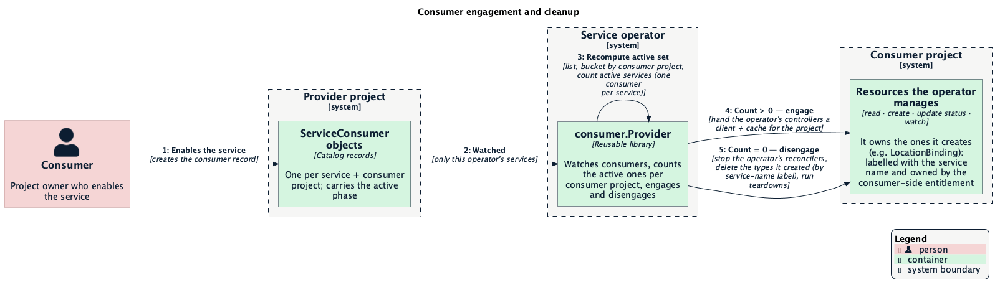
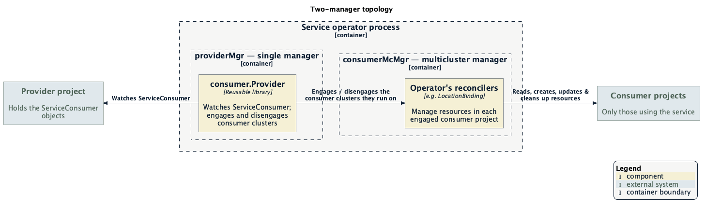

# Engage consumer projects only while a service is in use

**Status:** Proposed

## Summary

Any Milo service operator that integrates with the platform and
manages resources in its consumers' projects has to answer one question:
*which projects should I be acting in right now?* This enhancement answers it
precisely — engage a consumer project **only while it has an active consumer**
for the operator's service, and clean up the resources the operator created there
automatically when the last consumer goes away.

It ships as a small reusable library — a multi-cluster runtime provider — that an
operator plugs into its controller, the same way it already plugs in Milo's
platform provider. Engaging a consumer project gives the operator's controllers a
working connection to that project — to read, watch, create, and
update status on resources, exactly as they would in any cluster — but only for
the projects actually using the service. The operator declares the services it
owns and the resource types it owns there; the library handles engaging the right
projects and removing those resources when a project stops using the service.
There are no new APIs and no change to how services are enabled.

The service catalog is the first operator to integrate it (projecting location
availability), but that is a validation of the library, not its purpose: it is
built to be consumed by any service operator — networking, compute,
object-storage, and beyond.

This pairs with [#32](https://github.com/milo-os/service-catalog/issues/32): where
this library decides which projects an operator *engages*, #32 will scope what a
service is *permitted to access*, so a provider cannot reach projects that haven't
activated its service. Same signals, two layers — see [Access scoping](#access-scoping-32).

---

## Why this matters

When a project enables a service, the service operator needs to act inside that
project — reading what's there, creating and updating the
resources its service manages, reflecting status back. The specifics vary by
service (a networking operator wiring up connectivity, a storage operator
provisioning buckets, the catalog publishing available locations), but it always
means holding a live connection to that project. Today the
platform's default is to engage **every** active project, whether or not it has
anything to do with the operator's service. That default is right for Milo's own
platform controllers, but wrong for a service operator, and it costs us in three
ways:

- **Scale.** An operator watches, caches, and syncs against every project in the
  platform — potentially thousands — even though only a handful have enabled its
  service. That is wasted memory, connections, and API load that grows with the
  whole platform instead of with the operator's actual adoption.

- **No membership signal.** There is no built-in notion of "this project uses my
  service." Yet that signal already exists: enabling a service creates a consumer
  record, and the operator could simply follow it. Without that, operators lean
  on coarse, all-projects machinery and hope the right events fire.

- **No clean teardown.** When a project stops using a service, the resources the
  operator created there should be removed and the project dropped. There is no
  built-in way to do that scoped to a single service's usage, so cleanup is
  ad hoc and easy to get wrong — especially when two services share a project.

Any operator that projects into consumer projects hits all three the moment more
than a handful of projects exist — the catalog is simply the first to feel it,
with location-availability projection running against every project rather than
the ones that enabled the service.

## What good looks like

- **Follow usage, not the whole platform.** Engage a consumer project only while
  it has at least one active consumer for the operator's service; drop it when
  that count returns to zero. Cost tracks adoption, not platform size.

- **Clean up automatically.** Each service declares the resource types it
  manages; when a consumer deactivates the service, the operator's resources of
  those types in that project are deleted — scoped to the operator's own service
  so a neighbor's resources are never touched.

- **Reusable across services.** Any Milo service operator that projects into
  consumer projects can adopt it — networking, compute, object-storage, the
  catalog. The catalog happens to be first; nothing about the library is specific
  to it.

- **Safe by construction.** No way to misroute provider vs. consumer projects,
  and correct even across restarts — if a project stops using the service while
  the operator is down, cleanup still happens on the next reconcile.

## How it works

The idea is simple: instead of "engage every project that is ready," engage a
project **only while it has an active consumer for the service**. The platform
creates exactly one consumer record per (service, project) when a project enables
a service. The library watches those records, tracks how many of the operator's
services have an active consumer in each project, and engages or disengages that
project as the count crosses zero. (For an operator that owns a single service,
this is simply "is that one consumer active?") Engaging a project hands the
operator's
controllers a client and cache for that project — full read,
watch, create, update, and status access — so they manage resources there as they
would in any cluster. When the count drops to zero, the library removes the
resources the operator created there and drops the connection.

The rest of this section is the engineering detail behind that behavior.

This provider is the **consumer analogue** of Milo's provider. Milo's provider watches `Project` and engages on `Ready`; this provider watches `ServiceConsumer` in the **provider project** and engages a **consumer project** on active-membership.

<div align="center">
  
</div>

<sub>Source: [`consumer-provider-engagement.puml`](./consumer-provider-engagement.puml) (C4-PlantUML, datum-cloud theme).</sub>

### Two-manager topology

A caller runs **two** managers. The library owns the watch; the caller constructs `providerMgr` and launches the start/run goroutines.

<div align="center">
  
</div>

<sub>Source: [`consumer-provider-topology.puml`](./consumer-provider-topology.puml) (C4-PlantUML, datum-cloud theme).</sub>

The naming is deliberately aligned with `WithEngageWithProviderClusters`: from the operator's reconcilers' point of view, the engaged clusters are the ones the provider hands them. The operator's reconciler code is **unchanged** — it still uses `req.ClusterName` as the consumer project and `Manager.GetCluster(ctx, req.ClusterName)` for the consumer-scoped client, exactly as it does on the Milo manager today, and from there it reads, creates, updates, and watches like any controller-runtime client.

### How this maps to today's system

The design reuses pieces that already exist:

- A `ServiceConsumer` lives in the **provider** project. Its spec records the consumer project and the service; its status carries an `Active` phase that is the membership signal. It is created by the entitlement reconciler with a deterministic hash name (`sc-<hash of service + consumer project>`), so it cannot be looked up by consumer project from a delete event alone.
- A `LocationBinding` (`networking.datumapis.com/v1alpha`) is projected into the **consumer** project by the location-binding reconciler. It carries a `services.miloapis.com/service-name` label and an owner reference to the consumer-side `ServiceEntitlement`; the existing cleanup path lists by that label and filters by owner before deleting.
- The binary wires Milo's all-projects provider, a multicluster manager, and three reconcilers today, all engaging provider clusters — this is the path the flag will branch from.
- The upstream multicluster-runtime framework models a `Provider` as `Get` + `IndexField`, with `Run(ctx, Aware)` blocking and `Aware.Engage(ctx, name, cluster)` engaging. There is **no Disengage** — teardown is "cancel the per-cluster context." `Get` should return `multicluster.ErrClusterNotFound` (wrapped with `%w`) so the framework drops stale requeues for a disengaged cluster.
- Milo's own provider is the architectural reference: provider-is-a-reconciler-on-the-host-manager, host/path rewrite of a base config to reach a project, a readiness gate on the project conditions before engaging, and `cluster.New` → `WaitForCacheSync` → `Engage`. This enhancement mirrors that shape and improves on one detail — Milo's `Get` returns a plain error rather than the sentinel, so the framework logs avoidable errors; this provider returns the wrapped sentinel instead.

## Public API

```go
package consumer

// Provider engages a consumer project as a cluster.Cluster while that
// project has an active ServiceConsumer for at least one of Options.ServiceNames,
// and disengages it (cancelling the per-cluster context after teardown) once none
// remain. There is exactly one ServiceConsumer per (service, project) — its name
// is derived from the two — so the count is over Options.ServiceNames, never
// multiple consumers of a single service. It is both a controller-runtime reconciler — registered
// on the caller-supplied providerMgr, watching ServiceConsumer in the provider
// project — and a sigs.k8s.io/multicluster-runtime Provider whose engaged
// clusters are consumer projects.
type Provider struct { /* ... */ }

// New registers the provider as a reconciler on providerMgr. providerMgr MUST
// already be pointed at the PROVIDER project: it is the
// single source of truth for "which project hosts the ServiceConsumer objects."
// The provider derives the provider-project name from that manager's rest.Config
// and re-addresses it to the matching consumer project when engaging each one.
// There is no separate
// "ProviderProject" config field that could disagree with providerMgr — misrouting
// is structurally impossible.
func New(providerMgr manager.Manager, opts Options) (*Provider, error)

type Options struct {
    // ServiceNames is the set of Service names this operator owns. Only
    // ServiceConsumers whose spec.serviceRef.name is in this set are watched,
    // counted, and torn down. Required, non-empty. A provider project may
    // host ServiceConsumers for other services; those are ignored.
    ServiceNames []string

    // ClusterOptions is applied to every engaged consumer cluster.Cluster.
    // Callers MUST set the scheme here or consumer-side caches fall back to the
    // client-go global scheme and every consumer-side watch fails.
    ClusterOptions []cluster.Option

    // ManagedResources lists the resource types this operator CREATES AND OWNS in
    // a consumer project — the set to delete when the project deactivates. (An
    // engaged operator may also read or watch types it does not own; those are not
    // listed here and are never deleted.) On deactivation the provider deletes
    // every object of these types carrying the services.miloapis.com/service-name
    // label for one of ServiceNames. This is the declarative default — most
    // operators need only this list (the service catalog declares LocationBinding
    // here). Deletes are label-scoped and idempotent.
    ManagedResources []schema.GroupVersionKind

    // Teardowns is the escape hatch for cleanup a label-scoped delete cannot
    // express — ordering between types, finalizer coordination, or external
    // systems. Each runs (in order) AFTER ManagedResources deletion, AFTER the
    // per-cluster context is cancelled, and against a non-cached direct client.
    // Each must be idempotent. A non-nil error from ManagedResources deletion or
    // any teardown ABORTS disengage and requeues with backoff; the cluster stays
    // engaged.
    Teardowns []Teardown

    // newCluster is an injection seam for tests; defaults to cluster.New.
    newCluster func(*rest.Config, ...cluster.Option) (cluster.Cluster, error)
}

// Run binds the consumer multicluster manager to the provider, then blocks until
// ctx is done. Launch it in a goroutine alongside providerMgr.Start and
// consumerMcMgr.Start.
func (p *Provider) Run(ctx context.Context, mcMgr mcmanager.Manager) error

// Get returns the engaged cluster for consumerProject, or multicluster.ErrClusterNotFound
// wrapped with %w when the project is not currently engaged.
func (p *Provider) Get(ctx context.Context, consumerProject string) (cluster.Cluster, error)

// IndexField forwards a field index to every engaged consumer cluster.
func (p *Provider) IndexField(ctx context.Context, obj client.Object, field string, fn client.IndexerFunc) error

// Teardown removes the resources a single operator created in a consumer project
// when that project loses its last active ServiceConsumer for the caller's services.
type Teardown interface {
    // TeardownConsumer deletes the resources the caller created in the consumer
    // project. It MUST be idempotent and MUST scope deletes to the caller's
    // service (by the services.miloapis.com/service-name label and/or owner-ref)
    // — NEVER the coarse app.kubernetes.io/managed-by label, which a second
    // operator in the same project would share. It MUST NOT delete provider-side
    // ServiceConsumers. A non-nil error aborts disengage and is retried with
    // backoff (alert-only; never force-cancel, never auto-leak).
    TeardownConsumer(ctx context.Context, consumerProject string,
        consumerClient client.Client, serviceNames []string) error
}
```

The single-source-of-truth resolution (caller builds `providerMgr`; library reads the provider project from it) is the decided API. There is no `ProviderProject` field and no `ProjectRestConfig` field that could route to a different project than `providerMgr`.

## Integrating into a service operator

An operator consumes the library the same way it already consumes Milo's platform
provider: it stands up the managers, hands the provider the facts only it knows
(which services it owns, which project hosts its consumer records, which resource
types it creates and owns), and registers the controllers that act in the consumer
project. The library owns the watch and the engage/disengage lifecycle from
there; the controllers read, create, update, and watch against each engaged
project as they would in any cluster.

```go
// 1. A manager pointed at the operator's PROVIDER project — where its
//    ServiceConsumer records live. This is the single source of truth for
//    routing; the library reads the provider project from it.
providerMgr, _ := ctrl.NewManager(providerProjectCfg, ctrl.Options{Scheme: scheme /* ... */})

// 2. The provider: the services this operator owns, plus the resource types it
//    projects (deleted by service-name label when a project deactivates).
consumerProvider, _ := consumer.New(providerMgr, consumer.Options{
    ServiceNames:     []string{"my-service"},
    ClusterOptions:   []cluster.Option{func(o *cluster.Options) { o.Scheme = scheme }},
    ManagedResources: []schema.GroupVersionKind{ /* the types the operator creates here */ },
})

// 3. A multicluster manager whose membership is driven by the provider: its
//    engaged clusters are exactly the consumer projects using the service.
consumerMcMgr, _ := mcmanager.New(baseCfg, consumerProvider, mcmanager.Options{Scheme: scheme})

// 4. Register the controllers that act in the consumer project — UNCHANGED.
//    They still key off req.ClusterName (the consumer project) and
//    Manager.GetCluster for the consumer-scoped client, then read/create/update
//    as they would in any cluster.
_ = (&MyReconciler{ /* ... */ }).SetupWithManager(consumerMcMgr)

// 5. Gate on provider-project readiness, then start everything.
go func() { _ = consumer.WaitProviderProjectReady(ctx, baseCfg, providerProject); _ = providerMgr.Start(ctx) }()
go func() { _ = consumerProvider.Run(ctx, consumerMcMgr) }()
go func() { _ = consumerMcMgr.Start(ctx) }()
```

An operator's responsibilities are exactly two: this wiring, and honoring the
cleanup contract for the resources it creates — label, owner-ref, and declare
their types (see [Deactivation and cleanup](#deactivation-and-cleanup)).
Reconciler logic does not change; only which manager hosts it. An operator
building this fresh wires the library in as its only path into consumer control
planes. An operator that already acts in them the old way (like the catalog) can
put the switch behind a flag for a safe cutover — that is a migration choice, not
part of the library.

## Deactivation and cleanup

The requirement: when a consumer project stops using a service, every resource
that service created in that project is removed from the platform. Services own
their own custom resources, so the service declares the types it creates
(`Options.ManagedResources`) and the provider cleans exactly those up — the
platform never tries to enumerate resources generically. (This is about the
resources the operator *owns*; types it merely reads or watches are left alone.)

There is exactly one `ServiceConsumer` per (service, consumer project), so a
service is either active in a project or it isn't — there is never a "count of
consumers" for one service. Cleanup still happens at two granularities, and both
are needed:

- **One entitlement removed, the service stays active.** That single consumer can
  be backed by more than one `ServiceEntitlement` — for example, a service enabled
  directly *and* pulled in as a dependency of another service collapses to the same
  consumer. Removing one of those entitlements while another still backs the
  service leaves the consumer active, so the project stays engaged and no
  project-level teardown runs. The removed entitlement's resources are reclaimed by
  **owner-reference garbage collection**: every object the operator creates is
  owner-ref'd to its consumer-side `ServiceEntitlement`, so deleting the entitlement
  deletes them.

- **The service is deactivated, its consumer goes away.** When the last entitlement
  backing a service in a project is removed, that service's one `ServiceConsumer`
  disappears. If none of the operator's other services is still active in the
  project, the active count hits zero and the provider disengages: it cancels the
  operator's reconcilers for that cluster (so nothing re-creates resources
  mid-teardown), deletes every object of the declared `ManagedResources` types
  carrying the service-name label, then runs any custom `Teardown`. This is the
  authoritative sweep — it runs even if the per-entitlement GC was interrupted by
  the disengage.

This turns "all resources for the service are deleted" into a concrete contract
an adopter can satisfy for the resources it creates:

1. **Owner-ref** each created object to its consumer-side `ServiceEntitlement`
   (drives per-entitlement GC).
2. **Label** each created object `services.miloapis.com/service-name: <service>`
   (drives the whole-project sweep).
3. **Declare** each created type in `Options.ManagedResources` (and register a
   custom `Teardown` only where label-scoped deletion is insufficient).

The sweep is only as complete as what the operator declares — the provider
deletes the declared types, not "whatever happens to exist." Creating a new type
in consumer projects means adding it to `ManagedResources`; because the
declaration lives in the operator's own config, the service that owns the
resources is the one responsible for keeping the list complete.

> **Direction:** the operator-config `ManagedResources` here is the **interim**
> source. The decided end state is for the catalog to be the **authoritative**
> declaration of the resource types a service manages, so that consumer-facing
> discovery, approval-time governance, [access scoping](#access-scoping-32), and
> this cleanup all derive from one published fact and cannot drift. Once that
> lands, the operator consumes the catalog declaration instead of maintaining its
> own list. Tracked in #32.

Two properties fall out of keying cleanup on the active count rather than on
entitlement deletion specifically:

- **Provider-side revocation is covered.** If a provider revokes approval and a
  `ServiceConsumer` moves `Active → Denied`, the count drops to zero and the same
  teardown runs — deactivation is not limited to consumer-initiated deletion.
- **Restart-safe.** If the last consumer is removed while the operator is down,
  the list-based recompute on the next reconcile still sees the project at zero
  and tears down (see Design Decisions).

## Access scoping (#32)

This library decides **where an operator chooses to act**: it engages only the
consumer projects that have an active consumer for the service, so the operator's
controllers never watch or touch projects that haven't activated it. That is
cooperative — the operator's own controller declining to reach where it has no
business — not an access boundary. The operator's credentials may still be broad
enough to reach other projects; the library simply doesn't.

[#32](https://github.com/milo-os/service-catalog/issues/32) closes that gap by
turning the same facts into an **enforced** boundary. With the catalog as the
authoritative declaration of what a service manages, a service's access can be
scoped so it may act only in projects where it has an active consumer, and only on
the resource types it declared — so a provider **cannot reach a project that
hasn't activated its service**, even if it tried.

The two layers share their inputs, which is what makes interweaving them clean:

- The **active-consumer membership** this library computes per project is the same
  signal that scopes *access* per project.
- The **`ManagedResources` declaration** that drives cleanup is the same
  declaration that drives the verbs and types in the access grant — create,
  update, and delete on exactly those types.

So one published fact yields three consistent behaviors: the operator engages
activated projects (this library), is permitted to act only in them and only on
its own types (#32), and has those resources cleaned up when a project deactivates
(this library). Together they make "a service acts only in the projects that
activated it" both the default behavior and an enforced boundary — defense in
depth rather than a single control.

Two caveats while #32 is still ahead of us:

- Until it lands, engagement is cooperative only; this library is not a security
  control on its own.
- Access scoping applies to **consumer** projects. An operator legitimately needs
  standing access to its **own provider project** to watch its `ServiceConsumer`
  records; that is unaffected.

## Design Decisions

**List-based active-set recompute, not event-driven in-memory maps.** Each reconcile recomputes the active set by *listing* all `ServiceConsumer` objects in the provider project, filtering to `Spec.ServiceRef.Name ∈ ServiceNames`, bucketing by `Spec.ConsumerProjectRef.Name`, and counting how many of the operator's services have an active-and-not-deleting consumer in each project (at most one consumer per service, so this is a count of active *services*), then engaging/disengaging on the delta against the currently-engaged set. Two facts force this over the obvious watch-driven map:
1. `ServiceConsumer` is **hash-named**. A delete event delivers only the hash key; `Get` returns NotFound, so `Spec.ConsumerProjectRef.Name` — the consumer project we need to disengage — is unrecoverable from a delete event alone.
2. In-memory maps built from watch replay are **not restart-safe**: a `ServiceConsumer` deleted while the operator was down produces no replay event on restart, so a map-based design would never fire teardown for it. Listing on every reconcile (plus a periodic full resync) makes the correct state self-healing regardless of missed events.

**Service-name watch predicate + field index on `spec.serviceRef.name`.** A provider project may host `ServiceConsumer` objects for services owned by *other* operators. A `predicate` on the watch and a field index on `spec.serviceRef.name` ensure this provider only reconciles and counts its own services' consumers, both for trigger efficiency and for correctness of the count.

**Cancel before teardown.** The consumer project is engaged on `consumerMcMgr`, which runs the operator's reconcilers off a shared workqueue. If teardown deleted resources *before* cancelling the per-cluster context, a still-queued reconcile could re-create the very resources being deleted, racing the teardown. So the provider **cancels the per-cluster context first** (stopping the operator's reconcilers for that cluster), then tears down via a **non-cached direct client** built from the engaged cluster's `rest.Config` — the cache is being torn down, so a fresh direct client is required.

**Operator-declared resource types, service-name-scoped deletion.** Services own their own custom resources, so each operator declares the types it creates (`Options.ManagedResources`) rather than the library guessing. The provider deletes objects of those declared types — but it must scope deletion correctly, because the library is reusable and two operators can create resources in the same consumer project. The shared `app.kubernetes.io/managed-by: services-operator` label does not distinguish them; deleting by it would delete a sibling operator's resources. Deletion therefore scopes by `services.miloapis.com/service-name` and by owner-ref. Adopters MUST label every resource they create with `services.miloapis.com/service-name: <their service>` and owner-ref it to its consumer-side `ServiceEntitlement`; this is the documented contract (see [Deactivation and cleanup](#deactivation-and-cleanup)).

**Two-manager split.** The `ServiceConsumer` watch must run against the provider project, while the operator's reconcilers must run against consumer projects. These are different endpoints, so they cannot share one manager. `providerMgr` is a plain controller-runtime manager pointed at the provider project; `consumerMcMgr` is a multicluster manager whose membership is driven by this provider. The caller owns `providerMgr` (single source of truth for the provider project) and the start goroutines; the library owns only the watch and the engage/disengage lifecycle.

**Provider-project readiness gate + bounded cache sync.** `providerMgr` is a host manager pointed at the provider project. If that project is not yet ready, a plain `ctrl.NewManager(...).Start` crashloops the process. The provider gates on the provider `Project`'s `Ready` condition (read once from the base Milo cluster, mirroring Milo's provider) with bounded retry before Start. Per-consumer, `WaitForCacheSync` runs under a **timeout context** so that one slow or unreachable consumer project cannot head-of-line-block all other engagements under `MaxConcurrentReconciles: 1`.

**Keep the `if mcMgr == nil { requeue }` guard.** `Run` binds `mcMgr` after the manager starts. With two independently-started managers (`providerMgr` and `consumerMcMgr`) the window where the reconciler fires before `mcMgr` is bound is wider than in Milo's single-manager case, so the guard is retained: requeue ~2s rather than nil-panic.

**`ErrClusterNotFound` + `%w` wrapping at call sites.** `Get` returns `multicluster.ErrClusterNotFound` wrapped with `%w`, so the framework's `ClusterNotFoundWrapper` recognizes the sentinel and silently drops requeues for a disengaged cluster instead of logging errors. This is strictly more correct than Milo's plain `fmt.Errorf`; callers should preserve the sentinel.

**Persistently-failing teardown is alert-only.** A teardown that keeps failing is retried with backoff-bounded requeue and surfaced via metrics/alerts. The provider never force-cancels past a failing teardown and never auto-leaks: the cluster stays engaged until teardown succeeds, so resources are never silently abandoned.

## What Does Not Change

For any operator adopting the library: no new APIs, and its reconciler logic is
untouched — only which manager hosts it. The remaining points are about the
catalog's reference integration:

- The `ServiceEntitlement` / `ServiceConsumer` / `Service` API types and webhooks. No new CRD.
- `ServiceEntitlementReconciler` and `ServiceConsumerReconciler` — they stay on the all-projects Milo manager; the entitlement→consumer→approval lifecycle described in [Service Enablement Architecture](./service-enablement-architecture.md) is untouched.
- The `ServiceConsumer` hash-naming scheme.
- `LocationBindingReconciler`'s reconcile logic, the three-gate model, and the `LocationBinding` projection shape from [Locations as Platform Primitives](./locations-platform-primitive.md) — only which manager hosts it changes, and only behind the flag.
- Milo's own multicluster-runtime provider — this is a sibling library, not a modification.
- The default behavior of service-catalog: with `--consumer-scoped-projection=false` (the default), `LocationBinding` projection runs exactly as it does today.

## Open Questions

1. **`ResolveProviderProject` in v1?** The decided API derives the provider project from `providerMgr` (single source of truth). Should the library *also* offer a convenience that resolves the provider project from a `Service`'s `spec.owner.producerProjectRef` and builds `providerMgr` for the caller? It removes a wiring step but reintroduces the two-source-of-truth foot-gun if a caller passes both. Recommendation: defer past v1; keep caller-constructed `providerMgr` as the only path initially.
2. **Multiple provider projects per operator.** v1 assumes one provider project per operator (`--provider-project`). An operator whose `ServiceConsumer` objects are spread across several provider projects would need one provider+watch per project. Out of scope for v1; revisit if a real multi-provider-project operator appears.
3. **Periodic resync interval.** A periodic full resync is needed for correctness — to catch consumers removed while the operator was down — but the interval (and whether it should align with the location-binding resync interval of 5m) is a tuning question for once engaged-cluster-count metrics exist.
4. **Shared consumer across entitlements.** Because the `ServiceConsumer` name is derived from (service, project), several `ServiceEntitlement`s for the same service in a project share one consumer. The "one entitlement removed, the service stays active" guarantee depends on the entitlement reconciler deleting that shared consumer only when the *last* backing entitlement is removed (reference-counting), not on the first deletion. The entitlement reconciler currently deletes it unconditionally on any entitlement delete — this provider's engagement is correct only once that is reference-counted. Tracked as a prerequisite fix in the entitlement reconciler.

## References

- [Service Enablement Architecture](./service-enablement-architecture.md)
- [Locations as Platform Primitives for Service Consumers](./locations-platform-primitive.md)
- [Downstream Push Architecture](./downstream-push-architecture.md)
</content>
</invoke>
