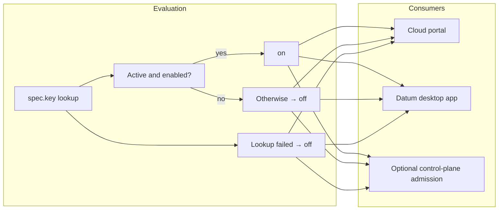
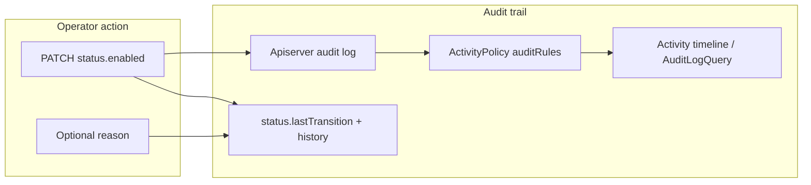
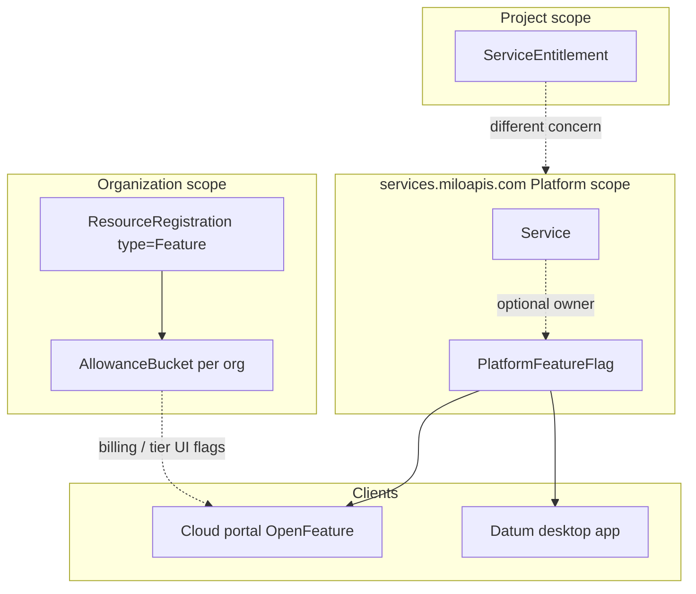

# Platform feature flags

- [Summary](#summary)
- [Motivation](#motivation)
  - [Goals](#goals)
  - [Non-Goals](#non-goals)
- [Proposal](#proposal)
  - [User Stories](#user-stories)
  - [Notes/Constraints/Caveats](#notesconstraintscaveats)
  - [Risks and Mitigations](#risks-and-mitigations)
- [Design Details](#design-details)
  - [PlatformFeatureFlag resource](#platformfeatureflag-resource)
  - [Access control](#access-control)
  - [Evaluation](#evaluation)
  - [Audit and change history](#audit-and-change-history)
  - [Relationship to other mechanisms](#relationship-to-other-mechanisms)
  - [Client integration (informative)](#client-integration-informative)
- [Production Readiness Review Questionnaire](#production-readiness-review-questionnaire)
  - [Feature Enablement and Rollback](#feature-enablement-and-rollback)
  - [Rollout, Upgrade and Rollback Planning](#rollout-upgrade-and-rollback-planning)
  - [Monitoring Requirements](#monitoring-requirements)
  - [Dependencies](#dependencies)
  - [Scalability](#scalability)
  - [Troubleshooting](#troubleshooting)
- [Implementation History](#implementation-history)
- [Drawbacks](#drawbacks)
- [Alternatives](#alternatives)
- [References](#references)

## Summary

Rollout and kill-switch behavior on Milo is split across org-scoped quota Feature buckets, per-project service entitlements, and client env vars. None of that gives platform operators one runtime switch that applies everywhere.

This enhancement adds `PlatformFeatureFlag`, a cluster-scoped resource on `services.miloapis.com/v1alpha1`. Platform operators PATCH `status.enabled` on the root Platform API to turn behavior on or off for every org, project, and client. Clients evaluate flags fail-closed. Audit flows through apiserver audit, on-object `status.history`, and `ActivityPolicy` rules (the same pattern billing uses, not the read-only org `AllowanceBucket` path in cloud portal).

The first motivating flag is `networking.datumapis.com/auto-create-traffic-protection` (default on), shared by the Datum desktop app and cloud portal for auto-create WAF / traffic protection on tunnel and edge create.

Sibling catalog docs: [`Service`](./service-registry.md), [`MeterDefinition`](./metering-definitions.md), [`MonitoredResourceType`](./monitored-resource-types.md). Enhancement template: [datum-cloud/enhancements/template](https://github.com/datum-cloud/enhancements/tree/main/enhancements/template).

## Motivation

Some product behavior should default on for everyone: auto-provisioning a default WAF when a tunnel is created, shipping a new UI path, or pausing a rollout during an incident. The platform team needs to change that behavior at runtime without redeploying every client or touching quota on every organization.

| Mechanism | Scope | What it answers |
|-----------|-------|-----------------|
| [`ServiceEntitlement`](./service-enablement.md) | Project | Has this project opted into this managed service? |
| Quota `AllowanceBucket` where `ResourceRegistration.type = Feature` | Organization | Does this org have entitlement to a commerce- or tier-gated feature? |
| Env / build vars (e.g. Datum desktop app) | Install / release | Is this binary or deployment configured to do X? |

Auto-create WAF on tunnel create shows the gap. It is not "this project enabled networking." It is platform-wide behavior wired into create flows in the Datum desktop app and the cloud portal.

Org-scoped quota Feature buckets work for billing-gated UI but simulating a global rollout means creating or updating buckets per org. Env vars on the Datum desktop app are not shared with the portal and cannot be flipped mid-incident without a release.

### Goals

- One cluster-scoped catalog object per platform rollout or kill-switch, keyed by reverse-DNS `spec.key`.
- Platform operators PATCH `status.enabled` on the root Platform API; same result for every org, project, and user.
- Fail-closed client evaluation: behavior stays off unless lookup succeeds and finds an `Active` flag with `status.enabled: true`.
- Audit trail via apiserver audit, `status.lastTransition` / `status.history`, and `ActivityPolicy` summaries.
- First consumer: `networking.datumapis.com/auto-create-traffic-protection` (Datum desktop app + cloud portal).

### Non-Goals

- Replacing org-scoped Feature `AllowanceBucket` flags (billing / tier UI stays on quota).
- Per-project service enablement ([`ServiceEntitlement`](./service-enablement.md)).
- Arbitrary config payloads (v0 is boolean only).
- Percentage or cohort rollouts by org or project.
- Runtime service discovery (endpoints, health, routing).

## Proposal

Introduce `PlatformFeatureFlag` on `services.miloapis.com/v1alpha1`, cluster-scoped, Platform parent context (root etcd, same as `Service` and `MeterDefinition`). Operators register flags once, flip `status.enabled` once, and clients pick up changes within cache TTL.

### User Stories

#### Platform operator disables auto-create WAF during an incident

An operator sees false positives from default traffic protection rules. They open the platform operator UI (or use kubectl), PATCH `status.enabled: false` on `auto-create-traffic-protection`, and supply a change reason. Within client cache TTL, the Datum desktop app stops auto-creating `TrafficProtectionPolicy` on tunnel create and the cloud portal stops defaulting WAF enforcement to on. Activity timeline shows who disabled the flag and when.

#### Platform operator re-enables after fix

After deploying updated rules, the operator PATCHes `status.enabled: true`. New tunnels and edge creates resume auto-provisioning. `status.history` on the object records the flip without a separate audit query.

#### Client evaluates flag fail-closed

The Datum desktop app fetches platform flags at session start. If the Milo API is unreachable, auto-create WAF stays off rather than assuming default-on from env vars or a stale cache.

### Notes/Constraints/Caveats

- `spec.defaultEnabled` documents the bootstrap value when the object is first created. It is not a client-side fallback when the API is unreachable.
- During rollout, the Datum desktop app may honor `DATUM_CONNECT_CREATE_TRAFFIC_PROTECTION_POLICIES=false` as a local override until the platform flag is everywhere. When both exist, explicit operator off at platform scope wins.
- Org portal feature flags today (OpenFeature + org `AllowanceBucket`) are read-only evaluation with no `ActivityPolicy` and no operator toggle. `PlatformFeatureFlag` is a separate primitive.

<<[UNRESOLVED]>>
- Retired flags: remain readable forever in list/get APIs, or hidden from discovery while preserved in etcd?
- Change reason required on disable only, on every disable, or never?
- `status.history` cap (64 suggested): large enough for incident windows, small enough to keep status bounded?
- Cache TTL (5s suggested): tradeoff between incident response speed and API load.
<<[/UNRESOLVED]>>

### Risks and Mitigations

| Risk | Mitigation |
|------|------------|
| Operator disables flag; clients with long cache TTL keep old behavior | Short TTL (~5s); optional control-plane admission rejects CREATE when flag is off |
| API outage causes widespread behavior change (fail-closed) | Documented contract; auto-create WAF is safe to skip; operators monitor flag fetch errors |
| `status.history` grows unbounded | Cap at 64 entries; full record remains in apiserver audit |
| Confusion with org Feature AllowanceBuckets | Separate resource, API group placement, and doc table comparing scope |

## Design Details

### PlatformFeatureFlag resource

```yaml
apiVersion: services.miloapis.com/v1alpha1
kind: PlatformFeatureFlag
metadata:
  name: auto-create-traffic-protection
spec:
  key: networking.datumapis.com/auto-create-traffic-protection
  displayName: Auto-create traffic protection on tunnel / edge create
  description: When enabled, clients auto-provision a default TrafficProtectionPolicy on create.
  defaultEnabled: true
  owner:
    serviceRef:
      name: networking.datumapis.com
  phase: Active
status:
  enabled: true
  lastTransition:
    enabled: true
    changedAt: "2026-06-19T14:22:00Z"
    changedBy:
      username: platform-op@datum.net
      uid: "a1b2c3d4-e5f6-7890-abcd-ef1234567890"
    reason: "INC-4821: disable auto-create WAF during rule rollout"
    source: portal
  history:
    - enabled: false
      changedAt: "2026-06-18T09:00:00Z"
      changedBy:
        username: platform-op@datum.net
        uid: "a1b2c3d4-e5f6-7890-abcd-ef1234567890"
      reason: "Pre-release validation"
      source: kubectl
    - enabled: true
      changedAt: "2026-06-19T14:22:00Z"
      changedBy:
        username: platform-op@datum.net
        uid: "a1b2c3d4-e5f6-7890-abcd-ef1234567890"
      reason: "INC-4821 resolved"
      source: portal
  conditions: []
```

| Field | Value |
|-------|-------|
| API group | `services.miloapis.com/v1alpha1` |
| Kind | `PlatformFeatureFlag` |
| Scope | Cluster |
| Parent context | `Platform` (root etcd) |
| Discovery | `discovery.miloapis.com/parent-contexts=Platform` |

Two names, deliberately: `metadata.name` is the Kubernetes slug; `spec.key` is the reverse-DNS identifier clients pass to evaluators (same convention as [`Service`](./service-registry.md)).

Lifecycle in `spec.phase`: `Draft` → `Active` → `Retired`. Evaluators treat `Draft` and `Retired` as off. Optional `spec.owner.serviceRef` links to a registered `Service` for display and audit lineage only.

### Access control

Platform operators hold RBAC to create, read, update, and patch `PlatformFeatureFlag` on the root Platform API, including `status`. Service owners do not get write access through `spec.owner.serviceRef`.

v0 adds a platform-operator role (for example `services.miloapis.com-platformfeatureflag-admin`) with `platformfeatureflags.get`, `list`, `watch`, `update`, and `patch`. Portal operator UI and break-glass kubectl use the same bindings.

### Evaluation

Clients and optional control-plane admission share one rule. Evaluation is fail-closed.

1. Resolve the flag by `spec.key` (GET or cached list).
2. If lookup succeeds and the object is `Active`, use `status.enabled`.
3. If lookup succeeds but the object is missing, not `Active`, or `status.enabled` is false, treat as off.
4. If lookup fails (API error, timeout, auth failure, or no successful fetch yet), treat as off.

No `targetingKey`. No org, project, or user dimension.



### Audit and change history

Flipping a platform flag changes behavior for every org, project, and client. Audit is part of v0.

Three layers:

1. **Kubernetes apiserver audit.** Every PATCH is recorded (actor, verb, body, timestamp). Input to Milo activity.
2. **On-object history.** Controller appends to `status.history` and updates `status.lastTransition`. Only the controller writes these fields.
3. **ActivityPolicy summaries.** `auditRules` match PATCH events and produce human-readable timeline entries (billing pattern). The controller does not emit separate timeline events.

```yaml
apiVersion: activity.miloapis.com/v1alpha1
kind: ActivityPolicy
metadata:
  name: services.miloapis.com-platformfeatureflag
spec:
  resource:
    apiGroup: services.miloapis.com
    kind: PlatformFeatureFlag
  auditRules:
    - name: enable
      match: "!audit.user.username.startsWith('system:') && audit.verb in ['update', 'patch'] && has(audit.requestObject.status) && audit.requestObject.status.enabled == true"
      summary: "{{ actor }} enabled platform feature {{ audit.requestObject.spec.key }}"
    - name: disable
      match: "!audit.user.username.startsWith('system:') && audit.verb in ['update', 'patch'] && has(audit.requestObject.status) && audit.requestObject.status.enabled == false"
      summary: "{{ actor }} disabled platform feature {{ audit.requestObject.spec.key }}"
    - name: create
      match: "!audit.user.username.startsWith('system:') && audit.verb == 'create'"
      summary: "{{ actor }} registered platform feature {{ audit.requestObject.spec.key }}"
```

Change reason on write: portal UI or annotation `services.miloapis.com/change-reason` on PATCH. Cloud portal activity log queries results via `AuditLogQuery`.



### Relationship to other mechanisms



| Mechanism | Scope | Use for |
|-----------|-------|---------|
| `PlatformFeatureFlag` | Platform | Rollout kill switches, default-on product behavior shared across clients |
| Quota `Feature` + `AllowanceBucket` | Organization | Tier- and commerce-gated features |
| `ServiceEntitlement` | Project | Consumer opts into a managed service |

### Client integration (informative)

Implementation lives in consumer repos after this enhancement is approved.

**Cloud portal:** Extend Milo-backed OpenFeature provider (or composite). Platform keys read from root cluster API with no org `targetingKey`. Billing keys unchanged. Operator toggle reads `status.history` and sends change reason on PATCH.

```ts
await isPlatformFeatureEnabled(
  'networking.datumapis.com/auto-create-traffic-protection'
);
// false when off, not Active, or Milo API lookup fails (fail-closed)
```

**Datum desktop app:** Fetch flags at session start; cache ~5s; gate tunnel create traffic-protection auto-create; treat fetch failure as off.

**Optional admission:** Reject `TrafficProtectionPolicy` CREATE when linked platform flag is off.

## Production Readiness Review Questionnaire

### Feature Enablement and Rollback

#### How can this feature be enabled / disabled in a live cluster?

- [x] Other
  - Mechanism: PATCH `status.enabled` on the cluster-scoped `PlatformFeatureFlag` object (Platform parent context / root API).
  - Control plane downtime: not required.
  - Node downtime / reprovisioning: not required. Clients pick up changes within cache TTL.

#### Does enabling the feature change any default behavior?

Yes for registered flags with `defaultEnabled: true` and initial `status.enabled: true`. The motivating flag turns on auto-create traffic protection on tunnel / edge create when enabled.

#### Can the feature be disabled once it has been enabled?

Yes. PATCH `status.enabled: false`. Clients stop auto-provisioning on create within cache TTL. Existing resources are not deleted. Optional admission can block new CREATEs when off.

#### What happens if we reenable the feature if it was previously rolled back?

PATCH `status.enabled: true`. New create flows resume auto-provision. No migration of resources created while the flag was off.

#### Are there any tests for feature enablement/disablement?

Planned: controller tests for history append; client integration tests for fail-closed eval; ActivityPolicy rule tests against sample audit payloads.

### Rollout, Upgrade and Rollback Planning

#### How can a rollout or rollback fail?

Clients on old builds may ignore platform flags and use env vars only. Mitigation: optional admission; deprecate env override after platform flag ships. Partial API outage causes fail-closed (auto-create off everywhere), which is intentional.

#### What specific metrics should inform a rollback?

Spike in tunnel create failures, traffic protection admission denials, or operator flag toggle frequency during an incident window.

#### Were upgrade and rollback tested?

Not yet. Manual test plan: toggle flag in staging, verify Datum desktop app and portal behavior within TTL.

#### Is the rollout accompanied by any deprecations?

Transitional: `DATUM_CONNECT_CREATE_TRAFFIC_PROTECTION_POLICIES` env override on Datum desktop app deprecated once platform flag is live.

### Monitoring Requirements

#### How can an operator determine if the feature is in use by workloads?

LIST `PlatformFeatureFlag` objects; check `status.enabled` and `status.lastTransition`.

#### How can someone using this feature know that it is working for their instance?

- [x] API .status
  - `status.enabled`, `status.lastTransition`, `status.history`
- [x] Other
  - Activity timeline entries from `ActivityPolicy` on PATCH

#### What are the reasonable SLOs for the enhancement?

Platform flag read path available for client eval at the same SLO as other root Platform API reads. Flag flip visible to clients within cache TTL (target ~5s).

#### What are the SLIs an operator can use to determine the health of the service?

- [x] Other
  - Client-side flag fetch error rate (Datum desktop app, portal)
  - Apiserver audit / activity policy match rate for flag PATCHes

#### Are there any missing metrics that would be useful?

Per-flag eval latency and cache hit rate on clients; not required for v0 doc approval.

### Dependencies

#### Does this feature depend on any specific services running in the cluster?

- **services.miloapis.com API (Platform context)**
  - Clients LIST/GET `PlatformFeatureFlag`
  - Outage: fail-closed (behavior off)
- **activity.miloapis.com (ActivityPolicy + AuditLogQuery)**
  - Human-readable audit timeline
  - Outage: audit summaries missing; apiserver audit and on-object history remain

### Scalability

#### Will enabling / using this feature result in any new API calls?

Yes. Clients poll or LIST platform flags with short TTL (~5s per client session). Volume scales with connected Datum desktop app sessions and portal requests, not with org count.

#### Will enabling / using this feature result in introducing new API types?

Yes. `PlatformFeatureFlag`, cluster-scoped. Expected object count: small (tens of flags, not thousands).

#### Will enabling / using this feature result in increasing size or count of the existing API objects?

`status.history` capped at 64 entries per flag. Bounded status growth.

#### Will enabling / using this feature result in non-negligible increase of resource usage?

Minimal etcd footprint (low object count). Controller work on PATCH only.

### Troubleshooting

#### How does this feature react if the API server is unavailable?

Clients fail-closed (treat flag as off). Auto-create WAF and similar default-on behaviors stop until API recovers.

#### What are other known failure modes?

- **Stale client cache after operator flip**
  - Detection: compare `status.lastTransition.changedAt` to client behavior delay
  - Mitigation: reduce TTL; restart client session
- **ActivityPolicy not deployed**
  - Detection: PATCH in audit log but no timeline summary
  - Mitigation: deploy `services.miloapis.com-platformfeatureflag` ActivityPolicy

#### What steps should be taken if SLOs are not being met to determine the problem?

Check root Platform API health, client flag fetch logs, and `PlatformFeatureFlag` object state. Query activity via `AuditLogQuery` for recent PATCHes.

## Implementation History

- 2026-06: Provisional enhancement drafted in `milo-os/service-catalog` ([PR #44](https://github.com/milo-os/service-catalog/pull/44))

## Drawbacks

- Another catalog resource type to implement, RBAC, and document.
- Fail-closed on API errors disables default-on behaviors platform-wide during outages.
- Two flag systems (platform vs org AllowanceBucket) require clear operator training.

## Alternatives

| Alternative | Why not |
|-------------|---------|
| Bulk update org `AllowanceBucket` Feature flags | No single switch; operational burden scales with org count |
| Env / build vars only | Not shared across Datum desktop app and portal; requires release to flip |
| `ServiceEntitlement` or org-wide service defaults | Wrong scope; models per-project or per-service opt-in, not global kill switches |
| Hard-coded feature gates in each client | No central audit, no operator UI, divergent defaults |

## References

- [Enhancement template](https://github.com/datum-cloud/enhancements/tree/main/enhancements/template)
- [`service-registry.md`](./service-registry.md)
- [`service-enablement.md`](./service-enablement.md)
- [`service-enablement-architecture.md`](./service-enablement-architecture.md)
- Cloud portal `app/modules/feature-flags/` (org AllowanceBucket; read-only, no ActivityPolicy)
- Cloud portal `app/resources/activity-logs/` (`AuditLogQuery`)
- `milo-os/billing/config/components/activity-policies/` (`ActivityPolicy` reference)
