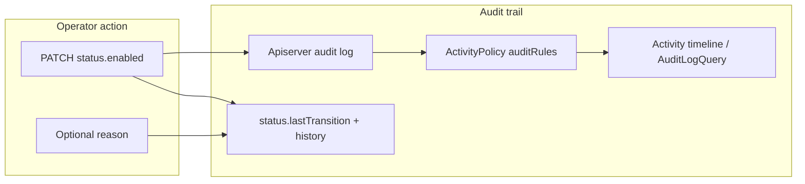
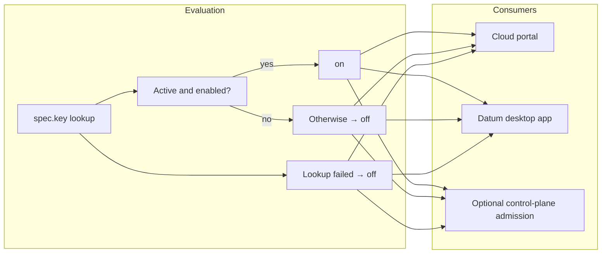
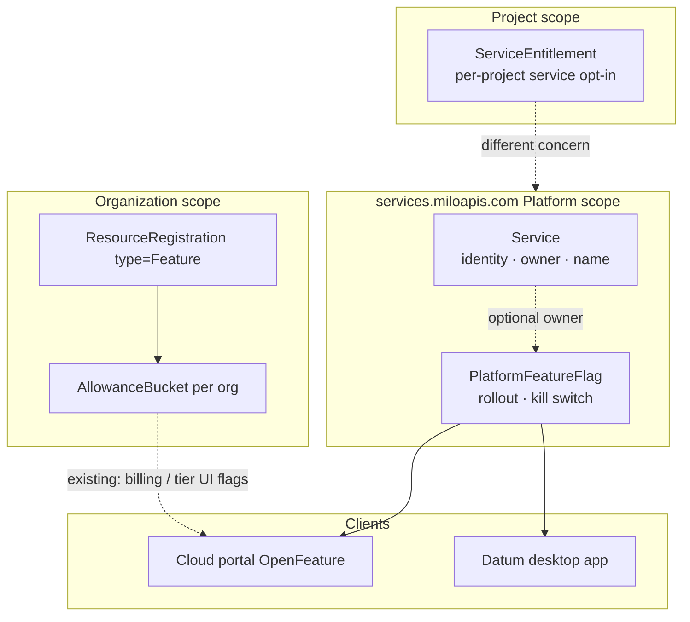

# Enhancement: Platform Feature Flags

**Status:** Draft for stakeholder review
**Scope:** Introduces `PlatformFeatureFlag`, a cluster-scoped resource on `services.miloapis.com/v1alpha1`. Sibling to [`Service`](./service-registry.md), [`MeterDefinition`](./metering-definitions.md), and [`MonitoredResourceType`](./monitored-resource-types.md).

> **In one line.** One cluster-scoped record operators flip to turn rollout behavior on or off for every org, project, and client.

---

## What a platform feature flag is

Some product behavior should default on for everyone: auto-provisioning a default WAF when a tunnel is created, shipping a new UI path, or pausing a rollout during an incident. The platform team needs to change that behavior at runtime without redeploying every client or touching quota on every organization.

A platform feature flag is that switch. One cluster-scoped record, one boolean, the same answer for every org, project, and user.

## Why Milo needs this primitive

Rollout and kill-switch behavior today lives in mechanisms built for other jobs.

| Mechanism | Scope | What it answers |
|-----------|-------|-----------------|
| [`ServiceEntitlement`](./service-enablement.md) | **Project** | Has this project opted into this managed service? |
| Quota `AllowanceBucket` where `ResourceRegistration.type = Feature` | **Organization** | Does this org have entitlement to a commerce- or tier-gated feature? |
| Env / build vars (e.g. Datum desktop app) | **Install / release** | Is this binary or deployment configured to do X? |

None of them gives operators one switch that applies everywhere at runtime.

Auto-create WAF on tunnel create is the kind of thing that shows the gap. It is not "this project enabled networking." It is platform-wide behavior wired into create flows in the Datum desktop app and the cloud portal. Service entitlements answer the wrong question.

Org-scoped quota Feature buckets work for billing-gated UI (billing dashboard visibility, for example) but simulating a global rollout means creating or updating buckets per org. Bulk AllowanceBucket work is a workaround, not a catalog primitive.

Env and build vars on the Datum desktop app are not shared with the portal, cannot be flipped mid-incident without a release, and do not give control-plane admission a single source of truth.

What operators need is a catalog object: register the flag once, PATCH `status.enabled` once, and every client that cares picks it up within cache TTL.

## How it works

### Registering a flag

Platform operators (or automation on their behalf) create one `PlatformFeatureFlag` per rollout or kill-switch the platform exposes. The canonical identifier lives in `spec.key`; `metadata.name` is the Kubernetes slug.

```yaml
apiVersion: services.miloapis.com/v1alpha1
kind: PlatformFeatureFlag
metadata:
  name: auto-create-traffic-protection
spec:
  key: networking.datumapis.com/auto-create-traffic-protection
  displayName: Auto-create traffic protection on tunnel / edge create
  description: When enabled, clients auto-provision a default TrafficProtectionPolicy on create.
  defaultEnabled: true
  owner:
    serviceRef:
      name: networking.datumapis.com
  phase: Active
status:
  enabled: true
  lastTransition:
    enabled: true
    changedAt: "2026-06-19T14:22:00Z"
    changedBy:
      username: platform-op@datum.net
      uid: "a1b2c3d4-e5f6-7890-abcd-ef1234567890"
    reason: "INC-4821: disable auto-create WAF during rule rollout"
    source: portal
  history:
    - enabled: false
      changedAt: "2026-06-18T09:00:00Z"
      changedBy:
        username: platform-op@datum.net
        uid: "a1b2c3d4-e5f6-7890-abcd-ef1234567890"
      reason: "Pre-release validation"
      source: kubectl
    - enabled: true
      changedAt: "2026-06-19T14:22:00Z"
      changedBy:
        username: platform-op@datum.net
        uid: "a1b2c3d4-e5f6-7890-abcd-ef1234567890"
      reason: "INC-4821 resolved"
      source: portal
  conditions: []
```

Two names, deliberately. Same convention as [`Service`](./service-registry.md): `metadata.name` is the slug for `kubectl` and RBAC; `spec.key` is the reverse-DNS identifier clients pass to evaluators and OpenFeature helpers.

Optional `spec.owner.serviceRef` links the flag to a registered `Service` for portal display and audit lineage. It does not affect evaluation scope.

Lifecycle lives in `spec.phase`: `Draft` → `Active` → `Retired`. While `Draft`, the flag is visible to operators but evaluators treat it as off unless a test harness overrides that. While `Retired`, evaluators treat the flag as off; the object stays for audit.

Operators PATCH `status.enabled` to turn behavior on or off globally. Spec holds intent and defaults; status holds the live switch.

Platform operators hold RBAC to create, read, update, and patch `PlatformFeatureFlag` objects on the root (Platform) API, including `status`. Service owners and project admins do not get write access through `spec.owner.serviceRef`; ownership is for display and audit lineage only. v0 adds a platform-operator role (for example `services.miloapis.com-platformfeatureflag-admin`) with `platformfeatureflags.get`, `list`, `watch`, `update`, and `patch` on the Platform parent context. Portal operator UI and break-glass kubectl use the same bindings.

### Audit and change history

Flipping a platform flag changes behavior for every org, project, and client. Post-incident review needs a clear record of who turned it off, when, and why. Audit is part of v0, not a follow-on.

This is not how org-scoped portal feature flags work today. The cloud portal evaluates Feature flags by reading org `AllowanceBucket`s via OpenFeature. That path has no `ActivityPolicy`, no on-object history, and no operator toggle. If someone PATCHes an `AllowanceBucket` manually, the change may appear only as a generic apiserver audit event. `PlatformFeatureFlag` gets an explicit audit design because it is a platform operator control with global blast radius.

Three layers stack:

1. **Kubernetes apiserver audit.** Every PATCH to `PlatformFeatureFlag` is recorded in the platform audit log (actor, verb, request body, timestamp). This is the raw record for compliance and forensics, and the input to Milo's activity system.
2. **On-object history in `status`.** The services controller appends each `status.enabled` change to `status.history` and updates `status.lastTransition`. Operators can read recent flips from the object without running an audit query. Org Feature `AllowanceBucket`s do not carry this today; it is new for platform flags.
3. **ActivityPolicy summaries.** An `ActivityPolicy` with `auditRules` matches `PlatformFeatureFlag` PATCH events and produces human-readable summaries for the activity timeline (same pattern as billing `ActivityPolicy` resources). The controller does not emit separate timeline events; activity is derived from apiserver audit plus policy rules.

Example policy shape (lives in service-catalog config, shipped with the CRD):

```yaml
apiVersion: activity.miloapis.com/v1alpha1
kind: ActivityPolicy
metadata:
  name: services.miloapis.com-platformfeatureflag
spec:
  resource:
    apiGroup: services.miloapis.com
    kind: PlatformFeatureFlag
  auditRules:
    - name: enable
      match: "!audit.user.username.startsWith('system:') && audit.verb in ['update', 'patch'] && has(audit.requestObject.status) && audit.requestObject.status.enabled == true"
      summary: "{{ actor }} enabled platform feature {{ audit.requestObject.spec.key }}"
    - name: disable
      match: "!audit.user.username.startsWith('system:') && audit.verb in ['update', 'patch'] && has(audit.requestObject.status) && audit.requestObject.status.enabled == false"
      summary: "{{ actor }} disabled platform feature {{ audit.requestObject.spec.key }}"
    - name: create
      match: "!audit.user.username.startsWith('system:') && audit.verb == 'create'"
      summary: "{{ actor }} registered platform feature {{ audit.requestObject.spec.key }}"
```

The cloud portal activity log UI queries these via `AuditLogQuery` (`activity.miloapis.com/v1alpha1`). Platform-scoped flag changes appear there once the policy is deployed. Operator toggle UI in the portal reads `status.history` for inline context and relies on activity queries for the longer trail.

**`status.lastTransition`** holds the most recent flip: new value, timestamp, actor (`changedBy.username` and `changedBy.uid` from the authenticated subject on the write), optional `reason`, and `source` (`portal`, `kubectl`, `automation`, or `unknown`).

**`status.history`** is an append-only list of past transitions, newest first. Cap at a fixed size (64 entries suggested) so status size stays bounded. Older entries roll off the object but remain in apiserver audit.

**Change reason on write.** Callers may supply a short reason when PATCHing `status.enabled`:

- Portal operator UI: reason field on the toggle (required when disabling, optional when enabling; confirm in open questions).
- CLI / automation: request annotation `services.miloapis.com/change-reason` or a dedicated subresource field on the status update body.

The controller copies reason and actor into `lastTransition` and prepends to `history`. It does not accept client-supplied history; only the controller writes those fields. ActivityPolicy rules can include the reason in the summary when the annotation is present on the audit request.

**Spec and phase changes** (`spec.phase`, `spec.defaultEnabled`, registration fields) are always in apiserver audit. The controller writes history when it can derive a before/after boolean or phase. Add matching `auditRules` when those changes need human-readable activity lines.



### Placement

| Field | Value |
|-------|-------|
| API group | `services.miloapis.com/v1alpha1` |
| Scope | Cluster |
| Parent context | `Platform` (root etcd, same as `Service`, `MeterDefinition`) |
| Discovery | `discovery.miloapis.com/parent-contexts=Platform` |

### Evaluation rule

Clients and control-plane admission share one rule. Evaluation is **fail-closed**: behavior stays off unless the client successfully reads an `Active` flag with `status.enabled: true`.

1. Resolve the flag by `spec.key` (GET or cached list).
2. If the lookup **succeeds** and the object is `Active`, use `status.enabled`.
3. If the lookup **succeeds** but the object is missing, not `Active`, or `status.enabled` is false, treat as **off**. When the object exists but is not `Active`, ignore `spec.defaultEnabled`.
4. If the lookup **fails** (API error, timeout, auth failure, or no successful fetch yet), treat as **off**. Do not fail open on `spec.defaultEnabled` or a stale cache entry that says on.

`spec.defaultEnabled` documents the intended bootstrap value when the `PlatformFeatureFlag` is first created in the cluster. It is not a client-side fallback when the API is unreachable.

No `targetingKey`. No org, project, or user dimension.



### The bigger picture

Platform feature flags sit in the identity and governance catalog alongside `Service`. They are not entitlements and not quota.



| Mechanism | Scope | Use for |
|-----------|-------|---------|
| `PlatformFeatureFlag` | **Platform** | Rollout kill switches, default-on product behavior shared across clients |
| Quota `Feature` + `AllowanceBucket` | **Organization** | Tier- and commerce-gated features (billing dashboard, multi-account) |
| `ServiceEntitlement` | **Project** | Consumer opts into a managed service |

---

## What this unlocks

PATCH `status.enabled: false` and auto-create WAF (or any registered behavior) turns off for all orgs, projects, and Datum desktop app installs within client cache TTL.

The Datum desktop app, cloud portal, and optional admission can read the same `spec.key` instead of duplicating env vars or drifting on defaults.

Flags are registered in the catalog like other governance resources: discoverable, owned, lifecycle-managed. Not ad hoc strings copied into each repo.

Every flip leaves an audit trail on the object, in apiserver audit, and in the activity timeline via `ActivityPolicy`. On-call and post-incident review do not depend on guessing who changed env vars on a single install.

Project enablement and org tier gates stay on entitlements and quota. Platform rollouts get their own primitive.

## Motivating use case: auto-create traffic protection

**Key:** `networking.datumapis.com/auto-create-traffic-protection`

**Default:** on (`defaultEnabled: true`, initial `status.enabled: true`)

When on, the Datum desktop app creates a default `TrafficProtectionPolicy` when a tunnel is created. Cloud portal AI Edge and proxy create flows default WAF enforcement to on.

When off, clients skip auto-provision on create. Operators may still allow manual WAF creation depending on product policy. Optional control-plane admission can reject `TrafficProtectionPolicy` CREATE when the flag is off, which covers older desktop app builds and direct API calls.

During rollout, the Datum desktop app may keep honoring `DATUM_CONNECT_CREATE_TRAFFIC_PROTECTION_POLICIES=false` as an install-level override until the platform flag is everywhere. When both exist, an explicit operator off at platform scope should win; document that per client.

---

## Client integration (informative)

This enhancement defines the catalog primitive. Implementation lives in consumer repos. The following is the expected integration shape after approval.

### Cloud portal (OpenFeature)

Extend the existing Milo-backed OpenFeature provider, or add a composite provider:

- Keys that match registered `PlatformFeatureFlag.spec.key` read from the root cluster API with no org `targetingKey`
- Existing billing keys keep AllowanceBucket org evaluation unchanged
- Operator toggle UI reads `status.history` and sends `services.miloapis.com/change-reason` on PATCH when an operator flips a flag

Example helper shape:

```ts
await isPlatformFeatureEnabled(
  'networking.datumapis.com/auto-create-traffic-protection'
);
// Returns false when the flag is off, not Active, or the Milo API lookup fails (fail-closed).
```

### Datum desktop app

- Fetch platform flags from the Milo API at session start; cache with short TTL (~5s)
- Gate traffic-protection auto-create in the tunnel create path on flag evaluation; treat fetch failure as off
- Keep the env override as an emergency local opt-out until deprecation

### Optional: control-plane admission

Reject or warn on resource CREATE when a linked platform flag is off. Defense in depth for clients that have not picked up the flag yet.

---

## What this isn't

Not a replacement for org Feature AllowanceBuckets. Billing- and tier-gated UI flags stay on quota.

Not per-project service enablement. That remains [`ServiceEntitlement`](./service-enablement.md). Org-wide default enablement for services is out of scope for entitlements today and stays that way.

Not arbitrary config. v0 is boolean rollout/kill-switch only: no string payloads, JSON blobs, or per-key typing beyond on/off.

Not percentage or cohort rollouts. Staged rollout by org or project would be a different resource or a later extension.

Not runtime service discovery. No endpoints, health, or routing. Same boundary as [`Service`](./service-registry.md).

## What comes later

Percentage or cohort rollouts (enable for 10% of orgs) need targeting dimensions this v0 omits on purpose.

Codegen of OpenFeature keys from registered `PlatformFeatureFlag` objects for portal type safety.

Long-term export of flag history to cold storage before entries roll off `status.history` (apiserver audit retains the full record).

Flag templates in git to seed cluster state from the catalog repo on deploy, similar to other governance resources.

## Open questions

1. Retired flags: remain readable forever in list/get APIs, or hidden from discovery while preserved in etcd?
2. Cache TTL. Tradeoff between incident response speed and API load; 5s is a reasonable starting point.
3. Change reason required on disable only, on every disable, or never?
4. `status.history` cap (64 suggested): large enough for incident windows, small enough to keep status bounded?

---

## References

- [`service-registry.md`](./service-registry.md) — sibling Platform-scoped identity resource pattern
- [`service-enablement.md`](./service-enablement.md) — per-project opt-in; org-wide policy explicitly deferred
- [`service-enablement-architecture.md`](./service-enablement-architecture.md) — org-level default enablement marked out of scope
- Cloud portal `app/modules/feature-flags/` — existing org-scoped quota Feature pattern (OpenFeature + AllowanceBucket; read-only, no ActivityPolicy)
- Cloud portal `app/resources/activity-logs/` — `AuditLogQuery` activity UI
- `milo-os/billing/config/components/activity-policies/` — reference `ActivityPolicy` + `auditRules` pattern
